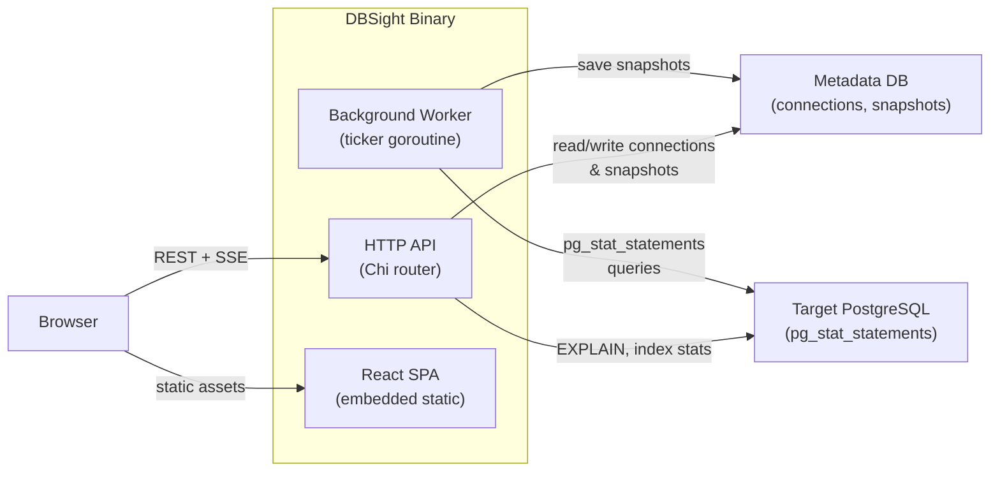

DBSight ships as a single self-contained binary. One process handles the HTTP API, a background metrics collector, and the React SPA — all embedded at compile time with `//go:embed`.

## High-Level Data Flow



1. **Worker** polls every target connection on a configurable interval (`WORKER_INTERVAL_SECS`), reads `pg_stat_statements`, and persists snapshots to the metadata DB.
2. **API** serves connection CRUD, query history, live SSE stream, EXPLAIN plans, and index analysis.
3. **SPA** is compiled into the Go binary via `//go:embed apps/web/dist` — no separate web server needed.

## Package Structure

| Package | Purpose |
|---|---|
| `main.go` | Cobra CLI (`serve`, `migrate`), wires all dependencies |
| `internal/config/` | Loads env vars into a typed `Config` struct |
| `internal/models/` | Shared domain types (`Connection`, `SlowQuery`, `IndexStat`, …) |
| `internal/store/` | `Store` interface + pgxpool implementation, migration runner |
| `internal/adapter/` | `DBAnalyzer` interface + PostgreSQL adapter (slow queries, EXPLAIN, indexes) |
| `internal/api/` | Chi router, middleware (logger, recovery, CORS), HTTP handlers |
| `internal/worker/` | Ticker-based scheduler, per-connection collector with concurrency limit |
| `internal/crypto/` | AES-256-GCM encrypt/decrypt for DSN storage |
| `migrations/` | SQL files embedded via `migrations/embed.go` |

## Key Design Decisions

### Single Binary

The entire application — API, worker, and frontend — compiles into one binary. Deployment is a single file copy plus env vars. No reverse proxy is required for basic use.

### Embedded Frontend

`//go:embed apps/web/dist` bakes the compiled React assets into the Go binary at build time. The Chi router serves static files directly and falls back to `index.html` for SPA client-side routing.

### Adapter Pattern

All database-specific logic lives behind the `DBAnalyzer` interface in `internal/adapter/`. The factory function `NewAdapter(dbType string)` returns the correct implementation. Adding MySQL or SQLite support means creating a new file that satisfies the interface — no changes to the API or worker.

### AES-256-GCM Encryption

Target database DSNs (which contain credentials) are encrypted before storage. The `ENCRYPTION_KEY` env var (64 hex chars = 32 bytes) is the only secret DBSight requires. The `EncryptedDSN` model field carries `json:"-"` so credentials are never serialized to API responses.

### Worker Concurrency

The scheduler caps concurrent collections at 10 (hardcoded in `internal/worker/scheduler.go`) to prevent overwhelming the metadata DB or target databases when many connections are registered.

## Startup Sequence

```
main() → cobra: "serve"
  └─ runServer()
       ├─ config.Load()          — validate env vars
       ├─ store.New()            — open pgxpool to metadata DB
       ├─ store.RunMigrations()  — idempotent SQL migrations
       ├─ go worker.Run(ctx)     — background goroutine
       └─ http.ListenAndServe() — Chi router
```

**Next:** [Contributing](/en/developer-guide/02-contributing) — set up a local development environment.
