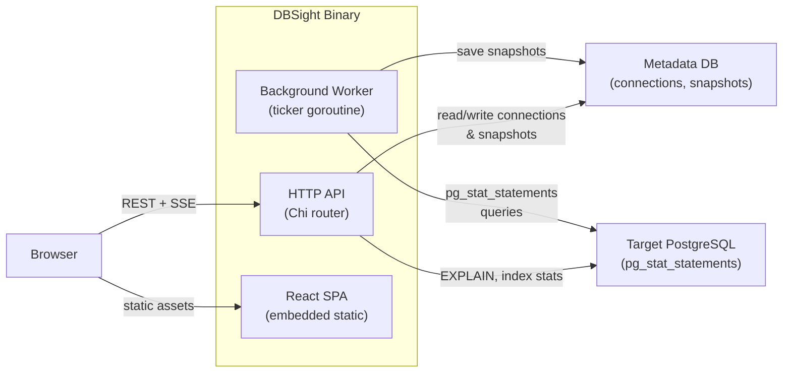

DBSight được phân phối dưới dạng một binary tự chứa duy nhất. Một tiến trình xử lý HTTP API, bộ thu thập số liệu nền và React SPA — tất cả được nhúng tại thời điểm biên dịch với `//go:embed`.

## Luồng Dữ liệu Cấp cao



1. **Worker** thăm dò mỗi kết nối đích theo một khoảng thời gian có thể cấu hình (`WORKER_INTERVAL_SECS`), đọc `pg_stat_statements` và lưu trữ các Snapshot vào cơ sở dữ liệu metadata.
2. **API** phục vụ CRUD kết nối, lịch sử truy vấn, luồng SSE trực tiếp, kế hoạch EXPLAIN và phân tích chỉ mục.
3. **SPA** được biên dịch vào binary Go qua `//go:embed apps/web/dist` — không cần máy chủ web riêng biệt.

## Cấu trúc Package

| Package | Mục đích |
|---|---|
| `main.go` | Cobra CLI (`serve`, `migrate`), kết nối tất cả các phụ thuộc |
| `internal/config/` | Tải biến môi trường vào cấu trúc `Config` có kiểu |
| `internal/models/` | Các kiểu domain dùng chung (`Connection`, `SlowQuery`, `IndexStat`, …) |
| `internal/store/` | Interface `Store` + triển khai pgxpool, trình chạy migration |
| `internal/adapter/` | Interface `DBAnalyzer` + adapter PostgreSQL (truy vấn chậm, EXPLAIN, chỉ mục) |
| `internal/api/` | Chi router, middleware (logger, recovery, CORS), HTTP handler |
| `internal/worker/` | Scheduler dựa trên ticker, bộ thu thập per-connection với giới hạn đồng thời |
| `internal/crypto/` | Mã hóa/giải mã AES-256-GCM để lưu DSN |
| `migrations/` | Các file SQL được nhúng qua `migrations/embed.go` |

## Các Quyết định Thiết kế Chính

### Binary Đơn

Toàn bộ ứng dụng — API, Worker và frontend — biên dịch thành một binary. Triển khai chỉ cần sao chép một file và thêm biến môi trường. Không cần reverse proxy cho việc sử dụng cơ bản.

### Frontend Nhúng

`//go:embed apps/web/dist` bakes các asset React đã biên dịch vào binary Go tại thời điểm build. Chi router phục vụ các file tĩnh trực tiếp và fallback về `index.html` cho routing phía client của SPA.

### Mẫu Adapter

Tất cả logic dành riêng cho cơ sở dữ liệu đều nằm sau interface `DBAnalyzer` trong `internal/adapter/`. Hàm factory `NewAdapter(dbType string)` trả về implementation đúng. Thêm hỗ trợ MySQL hoặc SQLite nghĩa là tạo một file mới thỏa mãn interface — không cần thay đổi API hay Worker.

### Mã hóa AES-256-GCM

DSN cơ sở dữ liệu đích (chứa thông tin xác thực) được mã hóa trước khi lưu trữ. Biến môi trường `ENCRYPTION_KEY` (64 ký tự hex = 32 byte) là bí mật duy nhất DBSight yêu cầu. Trường model `EncryptedDSN` có tag `json:"-"` để thông tin xác thực không bao giờ được serialize vào phản hồi API.

### Đồng thời Worker

Scheduler giới hạn số lần thu thập đồng thời ở mức 10 (được cố định trong `internal/worker/scheduler.go`) để tránh làm quá tải cơ sở dữ liệu metadata hoặc cơ sở dữ liệu đích khi có nhiều kết nối được đăng ký.

## Chuỗi Khởi động

```
main() → cobra: "serve"
  └─ runServer()
       ├─ config.Load()          — xác thực biến môi trường
       ├─ store.New()            — mở pgxpool đến metadata DB
       ├─ store.RunMigrations()  — migration SQL idempotent
       ├─ go worker.Run(ctx)     — goroutine nền
       └─ http.ListenAndServe() — Chi router
```

**Tiếp theo:** [Đóng góp](/vi/developer-guide/02-contributing) — thiết lập môi trường phát triển cục bộ.
